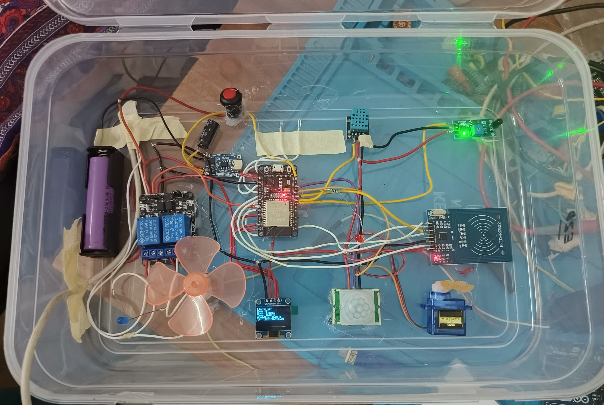

# Home Automation System - ESP32 Based

  

## 🚀 Project Overview

This is a comprehensive home automation system built using the **ESP32** microcontroller with the following key features:

- 💡 Light control via relay (active low)  
- 🌀 Fan control via relay (active low)  
- 🔐 RFID-based door lock with servo motor  
- 🕵️‍♂️ PIR motion sensor integration  
- 🔥 Flame detection sensor  
- 🌡️ DHT11 temperature and humidity monitoring  
- 🖥️ OLED display for local status  
- 🌐 Web interface for remote control  
- 🗣️ Sinric Pro integration for Alexa/Google Assistant voice control  
- 📡 OTA (Over-The-Air) firmware updates  

---

## 🔧 Hardware Components

- ESP32 Development Board  
- 2-Channel Relay Module (Active Low)  
- PIR Motion Sensor  
- Flame Detection Sensor  
- DHT11 Temperature/Humidity Sensor  
- RFID-RC522 Module  
- Servo Motor (for door lock)  
- OLED Display (I2C, 128x64)  
- Breadboard and jumper wires  

---

## 🧩 Pin Configuration

| Component         | ESP32 Pin     |
|-------------------|---------------|
| Light Relay       | GPIO 18       |
| Fan Relay         | GPIO 23       |
| PIR Sensor        | GPIO 13       |
| Red LED (Alert)   | GPIO 12       |
| Touch Pin 1       | GPIO 4        |
| Touch Pin 2       | GPIO 15       |
| Servo Motor       | GPIO 14       |
| DHT11             | GPIO 26       |
| Flame Sensor      | GPIO 25       |
| **RFID Module**   |               |
| - SCK             | GPIO 5        |
| - MISO            | GPIO 19       |
| - MOSI            | GPIO 27       |
| - SS              | GPIO 17       |
| - RST             | GPIO 16       |
| **OLED Display**  |               |
| - SDA             | GPIO 21       |
| - SCL             | GPIO 22       |

---

## ⚙️ PlatformIO Configuration

```ini
[env:esp32dev]
platform = espressif32
board = esp32dev
framework = arduino
monitor_speed = 115200

lib_deps =
  adafruit/Adafruit SSD1306@^2.5.14
  adafruit/Adafruit BusIO@^1.17.1
  miguelbalboa/MFRC522@^1.4.12
  adafruit/Adafruit Unified Sensor@^1.1.7
  adafruit/DHT sensor library@^1.4.4
  ESP32Servo
  sinricpro/SinricPro@^3.5.0


```


## ✨ Features

### Web Interface

- Responsive dashboard

- Real-time status updates

- Device control buttons

- Sensor data visualization

### Sinric Pro Integration

- Remote control via mobile app

- Voice control with Alexa/Google Assistant

- Device state synchronization

### Automation

- Motion-activated lighting

- Temperature-based fan control

- Emergency shutdown on flame detection

### Security

- RFID-based door access

- Multiple authorized cards supported

### Maintenance

- OTA firmware updates

- OLED system status display

## 🛠️ Setup Instructions

- Clone the repository

- Open the project in PlatformIO

- Configure Wi-Fi credentials in main.cpp:
```
const char *ssid = "YOUR_SSID";
const char *password = "YOUR_PASSWORD";
```
- Configure Sinric Pro credentials:
```
#define APP_KEY     "your-app-key"
#define APP_SECRET  "your-app-secret"
#define LIGHT_ID    "your-light-id"
#define FAN_ID      "your-fan-id"
#define DOOR_ID     "your-door-id"
```
- Upload the code to ESP32

## 🧪 Usage

- Access the web interface at: http://[ESP_IP]/

- Control via:

Web interface

Sinric Pro mobile app

Voice commands (Alexa/Google Assistant)

- Touch inputs

- RFID cards (door lock)

## 🔄 OTA Updates

- Visit http://[ESP_IP]/update

- Build the Project

- Upload new firmware .bin file from .pio > build > esp32dev > firmware.bin

- Device reboots automatically after update

## 🧠 Troubleshooting

- Devices not responding?

- Check relay wiring (active low configuration)

- Ensure correct GPIO pin assignments

- Verify power supply is sufficient

- Sinric Pro not working?

- Confirm device IDs match the Sinric dashboard

- Check internet connectivity

- Sensor issues?

- Double-check wiring

- Use Serial Monitor for debugging

## 📸 Project Media

[](https://youtube.com/shorts/JxVdrKY7gIk?feature=share)


📄 License

This project is licensed under the MIT License.

Made with ❤️ using ESP32, PlatformIO, and Open Source tools.